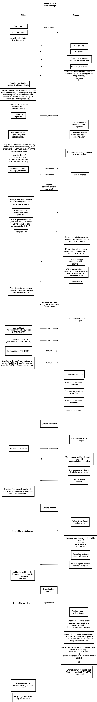

# Second and Third SIO Projects

This work aims to explore concepts associated with a **secure media player**, which enables clients to consume media content from a catalog, while enforcing **strong restrictions** through the use of **cryptographic primitives**.

## Course
This project was developed under the [Information And Organisational Security](https://www.ua.pt/en/uc/4143) course of [University of Aveiro](https://www.ua.pt/).


## Protocol Diagram
<p  align="center">

</p>

## Report
Full report: **DigitalRightsManagement.pdf**

## Install
```bash
apt install virtualenv
```
```bash
virtualenv -p python3 venv
```
```bash
bash
```
```bash
$ source ./venv/bin/activate
```
```bash
$ pip3 install -r client/requirements.txt
```
```bash
$ pip3 install -r server/requirements.txt
```

## Run
Run **server**:
```bash
python3 server/server.py
```
Run **client**
```bash
python3 client/client.py
```

## Technologies
* [**Twisted**](https://github.com/twisted/twisted) python framework.
* [**Requests**](https://github.com/psf/requests) package.
* In order to actually play media, the client relies on the **ffplay** tool from the [**FFmpeg**](https://github.com/FFmpeg/FFmpeg) project, and its capability of playing music provided from the **stdin**.

## Grades
This project's grades were:
* 2nd project: **20** out of 20
* 3rd project: **16,16** out of 20

## Authors
* **Eduardo Santos**: [eduardosantoshf](https://github.com/eduardosantoshf)
* **Margarida Martins**: [margaridasmartins](https://github.com/margaridasmartins)


